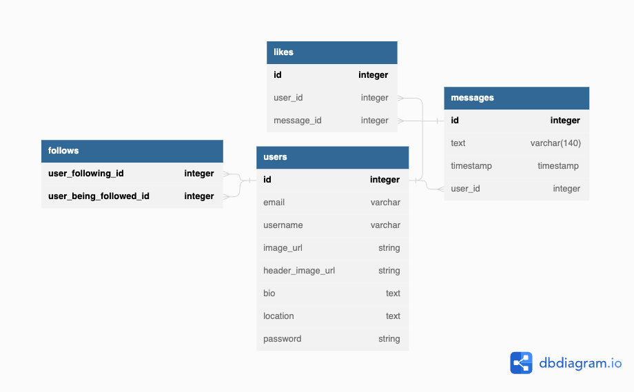

# Warbler Database Schema
The Warbler web application uses a PostgreSQL database to store user information, messages, and other data.

## Tables
### Users
The users table stores information about each registered user.

|Column Name	| Data Type	| Constraints|
|-|-|-|
|id |	Integer |	Primary Key|
|username|	String|	Unique, Not Null|
|email|	String|	Unique, Not Null|
|image_url| String| |
|header_image_url| String| |
|bio| Text| |
|location|String| |
|password|	String|	Not Null|

### Messages
The messages table stores information about each posted message.

|Column Name	| Data Type	| Constraints|
|-|-|-|
|id |	Integer |	Primary Key|
|text|	String|	Not Null|
|timestamp|	DateTime|	Not Null|
|user_id|	Integer|	Foreign Key, References users.id|

### Likes
The likes table stores information about each user's like on a message.

|Column Name	| Data Type	| Constraints|
|-|-|-|
|id |	Integer |	Primary Key|
|user_id|	Integer|	Foreign Key, References users.id|
|message_id|	Integer|	Foreign Key, References messages.id|

### Follows
The follows table stores information about each user's follow relationship with other users.

|Column Name	| Data Type	| Constraints|
|-|-|-|
|id |	Integer |	Primary Key|
|user_being_followed_id|	Integer| Primary Key,	Foreign Key, References users.id|
|user_following_id|	Integer| Primary Key,	Foreign Key, References users.id|

## ER Diagram

Warbler ER Diagram

## Notes
Each user can have many messages, likes, and follows.
Each message can have many likes and belongs to only one user.
Each like belongs to one user and one message.
Each follow relationship belongs to one user who is being followed and one user who is following.